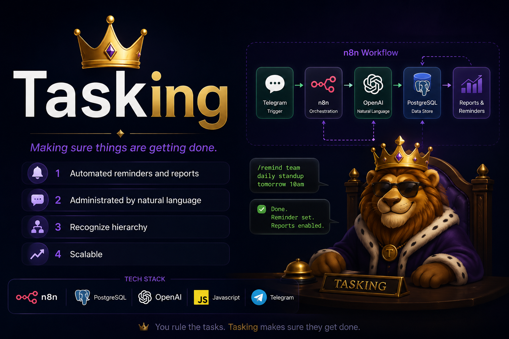
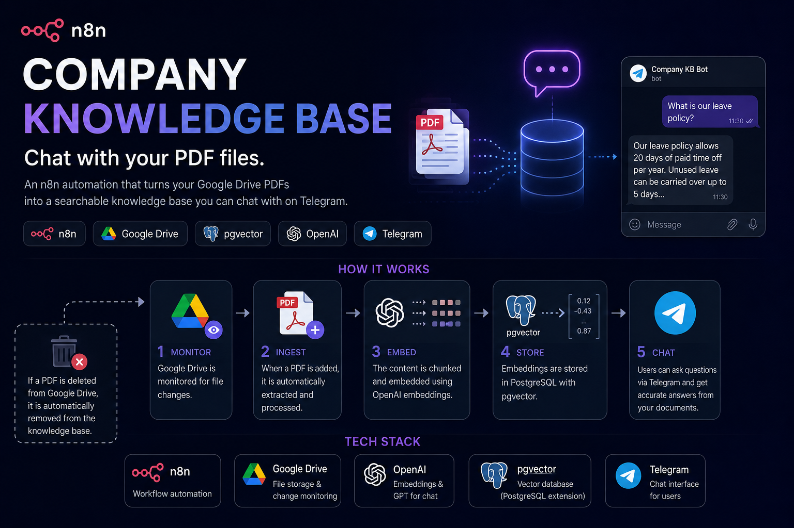
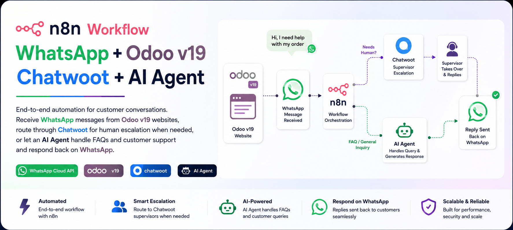

 

## 🧠 About Me

- 🔭 Always building scalable **AI-powered automation agents** with n8n, RAG pipelines, and chatagents (WhatsApp, website widgets, Odoo v19 integrations).
- 🛠️ Scaling my automation skills with SQL.
- 💡 I love turning repetitive workflows into self-running agents.
- ✨ Occational vibe codeing of integrated automation UI, websites or personal projects.
- 📫 Reach me: *mojtabamahdy2@gmail.com /  https://www.linkedin.com/in/mojtaba-mahdy-245964180*

 

## ⚙️ Tech & Tools

 

## 📌 Featured Projects

 

 

## 📊 GitHub Stats

 

## 📈 Contribution Snake

<!--START_SECTION:snake-->

<!--END_SECTION:snake-->

 

## 🤝 Connect With Me

