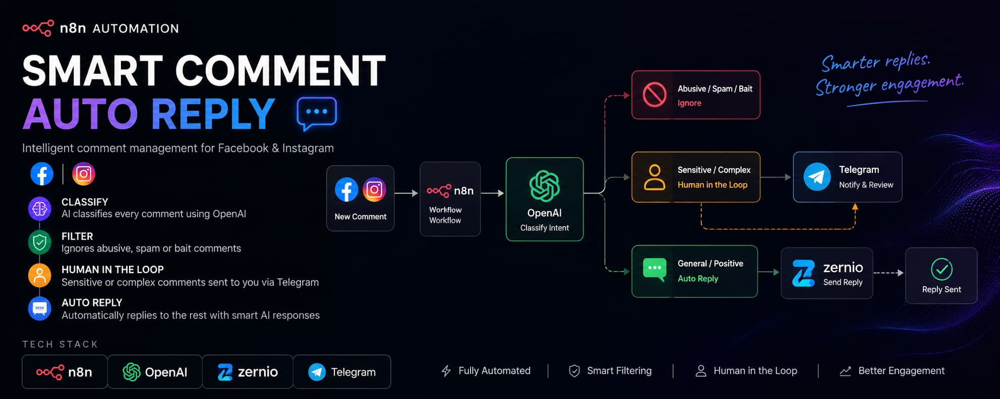
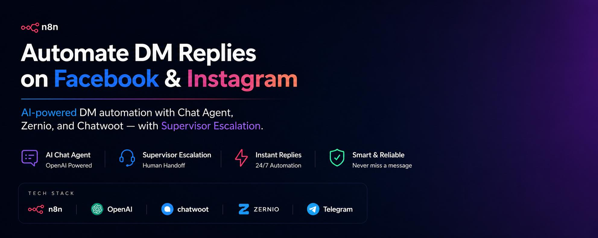
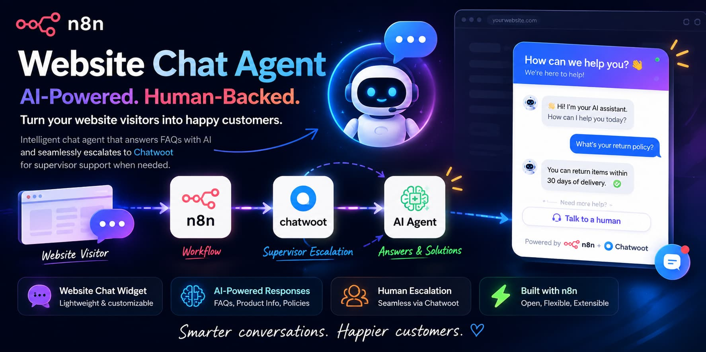
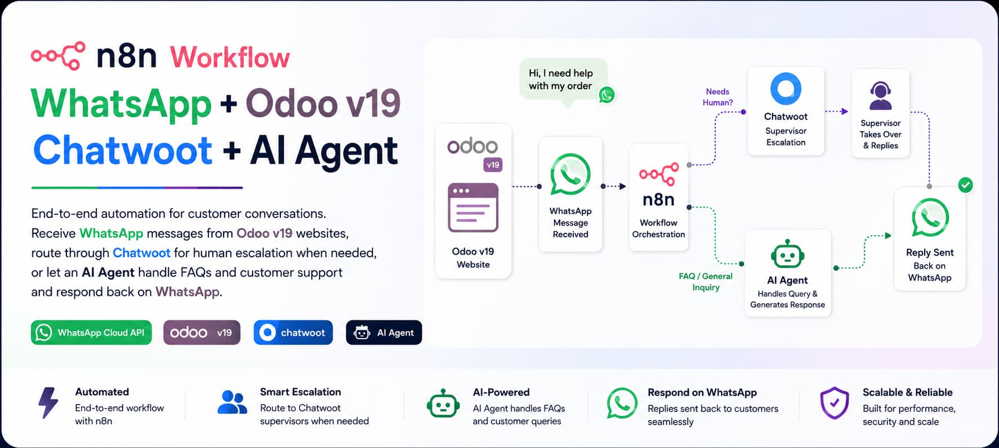
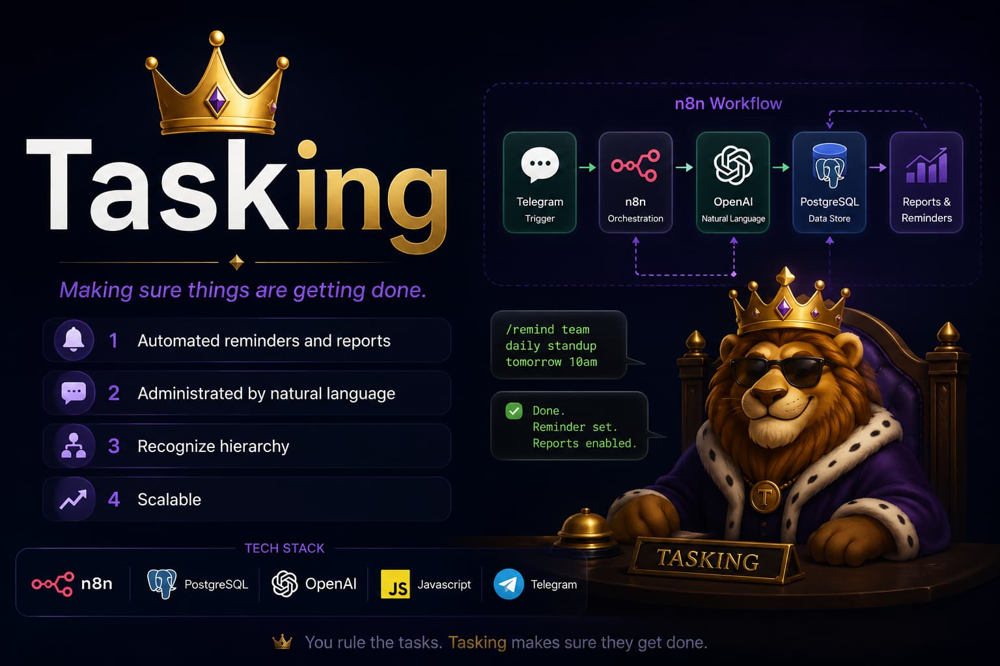
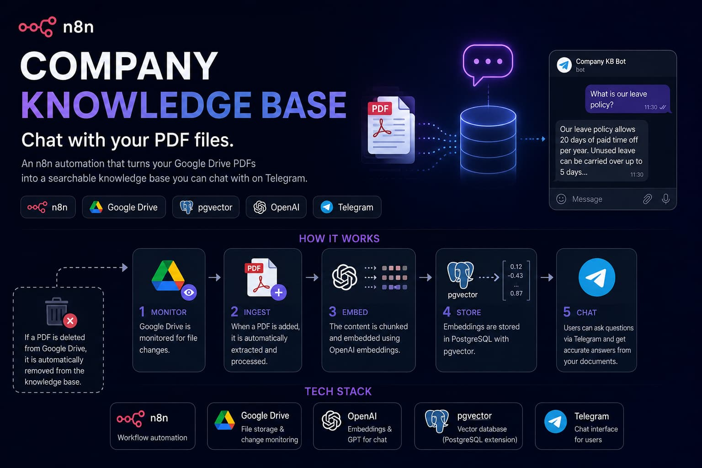
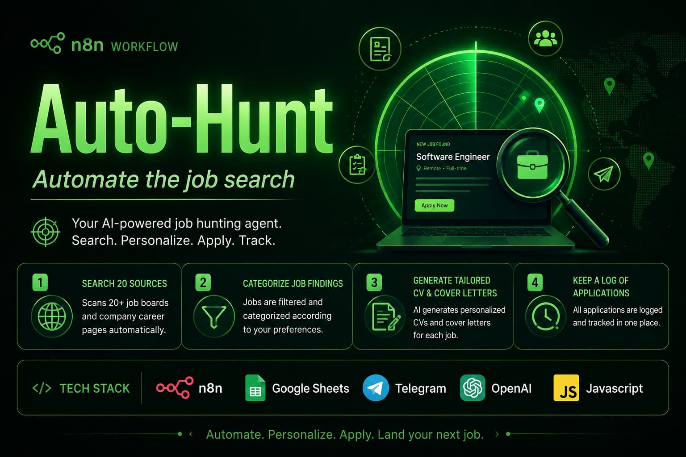

 

## 🧠 About Me

- 🔭 Always building scalable **AI-powered automation agents** with n8n, RAG pipelines, Social Media Automations and chatagents (WhatsApp, website widgets, Facebook and Instagram).
- 🛠️ Scaling automations with SQL.
- 💡 I love turning problems into self-running agents.
- ✨ Occational vibe codeing for integrated UIs, Dashboards or personal projects.
- 📫 Reach me: *mojtabamahdy2@gmail.com /  https://www.linkedin.com/in/mojtaba-mahdy-245964180*

 

## ⚙️ Tech & Tools

 

## 📌 Featured Projects
### Social Media Automations: 

 

### Internal Operations Projects: 

 

### Personal Projects: 

 
## 📊 GitHub Stats

 

## 📈 Contribution Snake

<!--START_SECTION:snake-->

<!--END_SECTION:snake-->

 

## 🤝 Connect With Me

